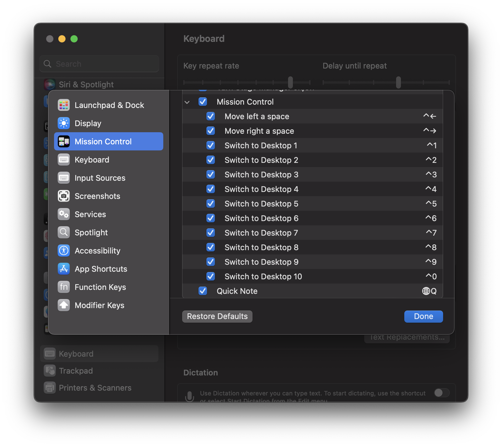
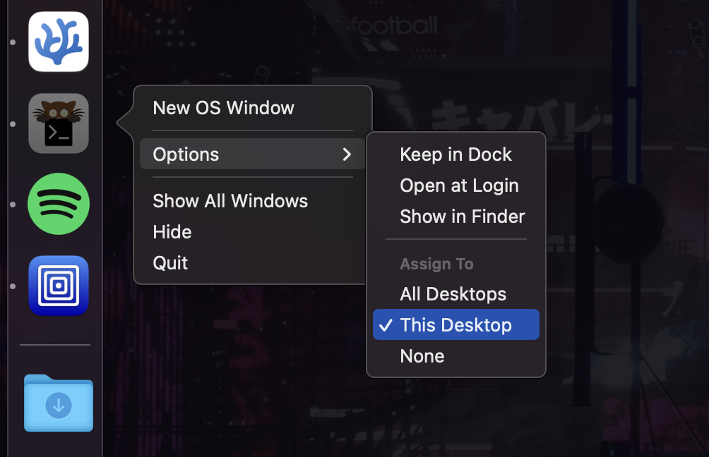

<div align="center">
    
    <h1 style="font-size: larger">MacOS automated setup</h1>
    <!-- <p style="font-size: small">Opinionated automation scripts to set up macOS.</p> -->
    <br>
</div>

Opinionated automation shell scripts to set up macOS. The script does the following:

- Restores current backup.
  - .config folder (in my case: fish, btop, kitty configs).
  - Amethyst preferences.
- Installs [Homebrew](https://brew.sh).
- Changes macOS default preferences. (this list could be out of date, check [preferences.sh](modules/preferences.sh) to see all changes.)
  - Dock: Position left, autohide, recents disabled
  - Finder: Show file extensions, hidden files, path bar, list view, keep folders on top, search scope current folder.
  - Spaces: Disable rearrange Spaces automatically, group by app in mission control.
  - Security: Enables firewall.
- Set default shell to [Fish](https://fishshell.com) for better features.

## Instructions

For the automated setup run:

```sh
git clone https://github.com/Jaycedam/mac-setup.git && cd mac-setup && bash main.sh
```

It will prompt you to install Xcode Command Line Tools if you don't have git.

:white_check_mark: Apple Sillicon on Ventura  
:white_check_mark: Apple Sillicon on Sonoma

## Manual settings

Some settings must be changed manually due to API limitation or lack of Apple documentation.

- Lock screen: Set required password after screen is off to **inmediatly** for security reasons.
- Spaces: Create more Spaces and enable keyboard shortcuts, then assign apps to their dedicated space. This will offer a better tiling window manager experience.




- Safari: Enable hide my ip and disable telemetry in Privacy tab.

## Update backup

To update the backup to your current config files, run `bash backup.sh`. This will backup the .config folder in your home directory, as well as your Amethyst settings. It also creates a Brew bundle with your installed packages, so you need Homebrew. Then running `main.sh` will restore your config files on a new setup. Since this is my personal config, if you don't install some listed packages you will need to remove its dependencies in the code to avoid issues.

## Todo

- [ ] Add vscodium profile/extensions backup/restore
- [x] Update terminal profile within script (Migrated to kitty)
- [ ] Automate manual settings post script
- [ ] Check if Brew is already installed
- [x] Add macOS preferences changes in README

## Acknowledgments

- [macOS defaults list](https://macos-defaults.com/)
- [Brew docs](https://docs.brew.sh/Manpage)
- [Project icon](https://www.flaticon.com/free-icon/continuous_8916345)
