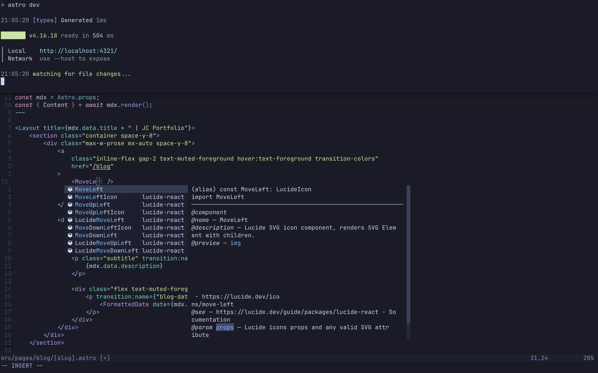

# MacOS Automated Setup

Automation scripts to set up macOS for software development and privacy.

- Installs [Homebrew](https://brew.sh).
- Restores the current backup:
    - Symlinks dotfiles from the repo to the home folder (.config/ and .zshrc).
    - Installs packages listed in a [Brewfile](Brewfile) using [brew](https://brew.sh) and [mas](https://github.com/mas-cli/mas) (for App Store apps).
- Changes some macOS default preferences; see the full list [here](modules/preferences.sh).

## Screenshots

I try to keep my config very minimal while maintaining only the features I need.

> [!NOTE]  
> I don't update these often, so they may be out of date.

### Ghostty and Neovim



## Automated setup

> [!CAUTION]
> This will overwrite your dotfiles. If you want to use this project with your own backup [read this first](#how-to-use).

Check dependencies:

```sh
git -v
```

Start:

```sh
git clone https://github.com/Jaycedam/mac-setup.git ~/Developer/mac-setup
cd ~/Developer/mac-setup && bash main.sh
```

## Manual settings

Some settings must be changed manually due to API limitation or lack of documentation. Check [this issue](https://github.com/Jaycedam/mac-setup/issues/13) for more details.

---

# How to use

If you want to use this project with your own dotfiles and configs, just follow these instructions:

> [!IMPORTANT]
> The path **~/Developer/mac-setup** is expected by the script; it's used to generate symlinks and relative path operations.

1. Fork the project then git clone (Replace **USERNAME** with yours):

```sh
git clone https://github.com/USERNAME/mac-setup.git ~/Developer/mac-setup
```

2. Delete my backup:

```sh
cd ~/Developer/mac-setup && rm -rf dotfiles/*
```

3. Back up your dotfiles and Brew packages. This moves your dotfiles to the project directory, then creates symlinks to $HOME. It will also back up your Brew packages into a Brewfile:

```sh
cd ~/Developer/mac-setup && bash backup.sh
```

> [!TIP]
> If you install new Brew packages, just run **backup.sh** again to update the Brewfile.

4. Make sure to change the USERNAME from the url in the [automated setup](#automated-setup) section to yours. Then push the changes to your repo.

---

## Credit

- [macOS defaults list](https://macos-defaults.com/)
