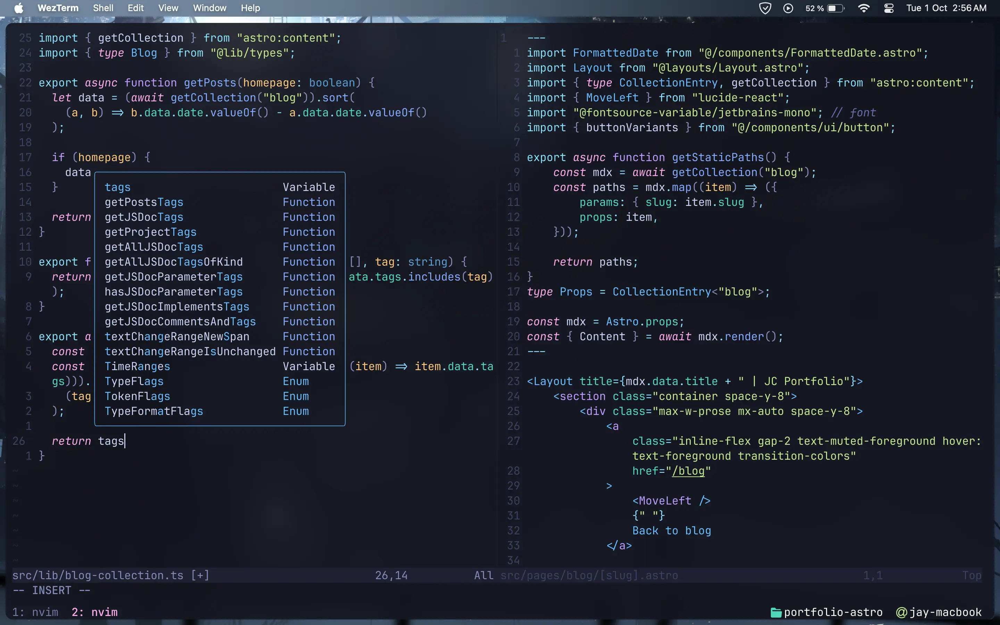

<div align="center">
    
    <h1 style="font-size: larger">MacOS automated setup</h1>
    <br>
</div>

Opinionated automation shell scripts to set up macOS. The script does the following:

- Installs [Homebrew](https://brew.sh).
- Restores current backup:
  - dotfiles (.config folder, .zshrc)
  - Installed packages by Homebrew on a [Brewfile](Brewfile).
- Changes some macOS default preferences, see full list [here](modules/preferences.sh).
- Creates a blank Firefox profile with [Betterfox's](https://github.com/yokoffing/BetterFox) user.js.

## Screenshots
> [!NOTE]  
> I don't update these often, so they can be out of date.

### Wezterm and Neovim


## Instructions

Clone the project, update the backup and sync your changes with your repo. Then just replace the URL for your own in the automated setup section,

> [!CAUTION]
> This is just an example, do not run this unless you want all my dotfiles and preferences. Make sure to backup your current dotfiles before.

Check dependencies:
```sh
git -v
```

Automatic setup:
```sh
mkdir ~/Developer
git clone https://github.com/Jaycedam/mac-setup.git ~/Developer/mac-setup
cd ~/Developer/mac-setup && sh main.sh
```

## Update the backup:
To update the backup to your own, just run 'backup.sh' from the project root directory. This will move your dotfiles (.zshrc and .config folder) to the project directory and create symlinks to your home folder. It will also back up all the brew packages into a Brewfile (homebrew must be already installed).

You only need to run this script once, now all your files will be managed in the mac-setup folder, so just update the remote branch to yours and push it to back it up.

## Manual settings

Some settings must be changed manually due to API limitation or lack of Apple documentation.

- Lock screen: Set required password after screen is off to **inmediatly** for security reasons.
- Safari: Enable hide my ip and disable telemetry in Privacy tab.
- Change Keyboard Shortcut **Move focus to next window** to ⌘| to enable changing instances of the same app (necessary on Latam Keyboard), available on **Keyboard - Keyboard Shortcuts - Keyboard**.

## Credit

- [macOS defaults list](https://macos-defaults.com/)
- [Brew docs](https://docs.brew.sh/Manpage)
- [Project icon](https://www.flaticon.com/free-icon/continuous_8916345)
