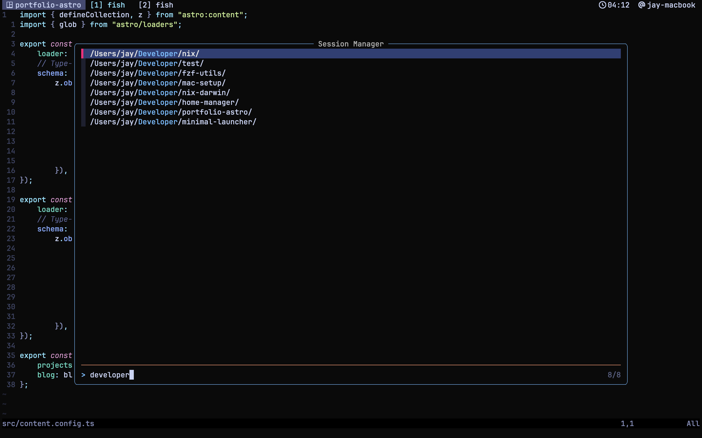

# MacOS Automated Setup

Automation scripts to set up macOS for software development, privacy and general use.

## Terminal workflow

I try to keep my config very minimal.
My main tools are Alacritty, tmux, fish shell, neovim and fzf utils.



## The main script:

- Installs [Homebrew](https://brew.sh).
- Restores current backup:
    - Symlinks [dotfiles](./dotfiles/) from the repo to the home folder.
    - Installs packages from a [Brewfile](Brewfile) using [brew](https://brew.sh), [mas](https://github.com/mas-cli/mas) and some missing [Language Servers](./modules/lsp.sh) missing from Brew, using npm.
- Changes macOS [default preferences](modules/darwin/defaults.sh) and specific [Darwin tweaks](./modules/darwin/enviroment.sh) (eg: TouchID for sudo).
- Changes default user shell to [Fish](https://fishshell.com).
- Remaps Caps Lock to ESC on tap and CTRL when combined whith another key (like CTRL-a for tmux). Using [Karabiner Elements](https://github.com/pqrs-org/Karabiner-Elements).

> [!CAUTION]
> This will overwrite your dotfiles. If you want to use this project with your own backup [read this first](#how-to-use-with-your-dotfiles).

Check dependencies:

```sh
git -v
```

Start:

```sh
git clone https://github.com/Jaycedam/mac-setup.git ~/Developer/mac-setup
bash ~/Developer/mac-setup/main.sh
```

Then select the option for the automatic setup.

## Manual settings

Some settings must be changed manually due to API limitation or lack of documentation. Check [this issue](https://github.com/Jaycedam/mac-setup/issues/13) for more details.

---

# How to use with your dotfiles

**It's always recommended to make a manual backup of your dotfiles.**
Start by forking the project and replacing USERNAME to yours. If you have questions you can open an issue.

> [!IMPORTANT]
> The path **~/Developer/mac-setup** is expected by the script; it's used to generate symlinks and relative path operations. If you want to use a different directory, you need to change the variable ROOT_DIR inside main.sh as well to reflect the change.

1. Clone and delete my dotfiles (replace USERNAME)

```sh
git clone https://github.com/USERNAME/mac-setup.git ~/Developer/mac-setup
rm -rf ~/Developer/mac-setup/dotfiles/*
```

2. Back up your dotfiles and Brew packages. This moves your dotfiles to the project directory, then creates symlinks to $HOME. It will also back up your Brew packages into a Brewfile (you need to have Brew installed):

```sh
bash ~/Developer/mac-setup/main.sh
```

Then select the option to update the backup.

> [!TIP]
> If you install new Brew packages, just repeat the step 2 above to update your backup.

---

## Credit

- [macOS defaults list](https://macos-defaults.com/)
